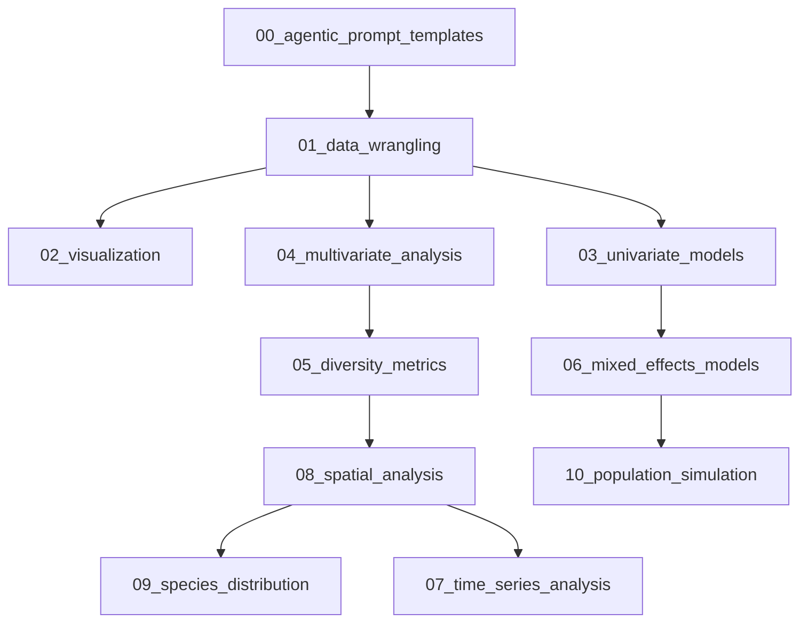

# 🌱 Vibe Coding for Ecology: Documentation Index

Welcome to the complete documentation for the **Vibe Coding for Ecology** project! This index provides organized access to all workflows, examples, and guidelines for agentic AI-assisted ecological analysis.

## 🎯 Quick Start

1. **For AI Agents**: Copy any workflow template and paste into your AI coding environment
2. **For Researchers**: Clone the repository and follow the structured workflows
3. **For Contributors**: Check the rules and contributing guidelines

## 📚 Documentation Structure

### 🔬 Workflow Categories

#### 🔢 Population Simulation

- [🤖 Agentic Ecology Analysis Template](workflows/agentic_ecology_analysis_template.md)

#### 🌿 Diversity Metrics

- [Comprehensive Diversity Metrics](workflows/alpha_beta_diversity.md)

#### 📊 Visualization

- [ggplot2 Fundamentals for Ecological Data](workflows/ggplot_fundamentals.md)

#### 📈 Univariate Models

- [Generalized Linear Models (GLMs) for Ecological Data](workflows/glm_workflow_template.md)
- [Mixed Effects Models: Hierarchical Models](workflows/hierarchical_models.md)

#### 🔬 Multivariate Analysis

- [Multivariate Analysis: Ordination, Clustering, and PERMANOVA](workflows/pca_ordination.md)

#### 🔢 Population Simulation

- [Advanced Population Simulation](workflows/population_simulation_workflow.md)

#### 00_other

- [Time Series Analysis: Seasonal Patterns](workflows/seasonal_patterns.md)
- [Univariate Models: Simple Linear Regression](workflows/simple_linear_regression.md)

#### 🗺️ Spatial Analysis

- [Spatial Analysis Essentials](workflows/spatial_analysis_workflow.md)

#### 🦋 Species Distribution

- [Species Distribution Modeling (SDM)](workflows/species_distribution_workflow.md)

#### 🧹 Data Wrangling

- [Data Wrangling Essentials](workflows/tidy_reshape_join_workflow.md)

### 📖 Examples & Templates

- [Load necessary libraries](examples/example_1.md)
- [Vibe Workflow: [Name of Analysis]](examples/example_2.md)
- [==== HIGH-LEVEL OBJECTIVE =====================================================](examples/prompt_for_agent.md)

### 📋 Rules & Guidelines

- [Contributing to Vibe Coding for Ecology](rules/CONTRIBUTING.md)
- [R Coding Rules for Ecology](rules/R_rules.md)

### 🏠 Main Documentation

- [Contributor Covenant Code of Conduct](CODE_OF_CONDUCT.md)
- [🌱 Vibe Coding for Ecology: Agentic AI Workflows](README.md)

## 🔄 Workflow Dependencies

The workflows are designed to build upon each other:

## 🧪 Quality Assurance

All documentation has been:
- ✅ **Linted** with markdownlint for consistency
- ✅ **Cross-referenced** for workflow interconnections
- ✅ **Badge-enhanced** for reproducibility tracking
- ✅ **Organized** in logical categories
- ✅ **Validated** for internal link integrity

## 🚀 Getting Started

### For AI Agents
1. Browse the workflow categories above
2. Copy the relevant workflow template
3. Paste into your AI coding environment (Claude, ChatGPT, Cursor, etc.)
4. Adapt to your specific research question

### For Manual Use
1. Clone the repository: `git clone https://github.com/Fabbiologia/vibe-coding-for-ecology`
2. Navigate to the workflow of interest
3. Follow the 5-part structure: 🪴 Setup → 🧹 Wrangle → 🔬 Analyze → 📊 Visualize → 🧬 Reproduce

## 📞 Support

- **Issues**: Report bugs or request features on [GitHub Issues](https://github.com/Fabbiologia/vibe-coding-for-ecology/issues)
- **Discussions**: Join the conversation on [GitHub Discussions](https://github.com/Fabbiologia/vibe-coding-for-ecology/discussions)
- **Contributing**: See [CONTRIBUTING.md](rules/CONTRIBUTING.md)

---

**Ready to start coding with vibe?** Choose your workflow and feel the difference that clarity and intention make in your analysis!

*Generated automatically by build_documentation.py*
